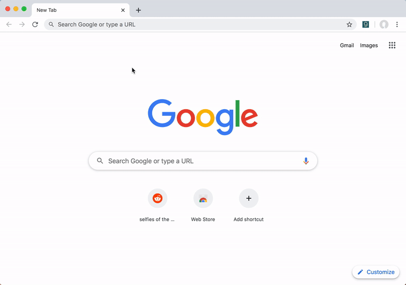

  

  <!-- Chrome extension badge -->
  
  
  <!-- Firefox extension badge -->
  

---

gata helps you find the information you need, quicker than ever.

gata allows you to define dynamic shortcuts allowing you to jump to the page you need, when you need it. Just supply gata with a URL, define some variables, and you're done!

Examples include:
- Going to a Twitter profile
- Jumping to a specific repository on Github
- Viewing your favourite Reddit, sorted how you choose

## How does it work?

To create a shortcut to go to a Twitter profile, we'll provide the URL "https://twitter.com/%s"

The "%s" signifies a variable. This is the part that you are going to fill in when you access the shortcut.

When you go to use this shortcut, gata will prompt you to enter the username you want to access and take you there.

## Features

- Keyboard navigation - access all your shortcuts without using your mouse
  - <kbd>Ctrl+.</kbd> (<kbd>⌘+.</kbd> on Mac) to open
  - Once open, start typing to filter to the shortcut you want
  - <kbd>Tab</kbd> to expand the first result
  - Fill out form using keyboard
  - <kbd>Enter</kbd> to navigate to page
- Syncing - your shortcuts are synced across Chrome browsers that are signed in with the same account

## Screenshots

|Viewing your shortcuts|Navigating to a shortcut|Creating a shortcut|
|---|---|---|
||||

## Contributing

The following information is provided in order to contribute to this project:

### Setup

The following will download, build, and install the extension in Chrome, allowing you to start developing.

1. Fork this repository and clone it to your local machine
1. Run `npm i` to install dependencies
1. Run `npm run build` to build
1. Go to `chrome://extensions` 
1. Turn on "Developer Mode" in the top-right
1. Click "Load unpacked"
1. Navigate to the `dist` directory and select it

Chrome will install the extension. After you make changes, run `npm run build` again and the extension should automatically update in Chrome. If not, just click the reload icon for gata on the extensions page.

### PRs

After you have made your change, push your branch to your forked copy and make a pull request into this repo. Make sure to reference any issues you closing with your change. I will be sure to review your change and and it integrated.

## Technologies

gata is built with:

- [Vue.js](https://addons.cdn.mozilla.net/static/img/addons-buttons/AMO-button_1.png)
- [Bulma](https://bulma.io/)
- [Parcel](https://parceljs.org/)
